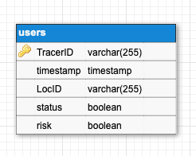

<br><br>

[](https://github.com/michael-spengler/Tracer-wwi19dsa/issues)
[](https://github.com/michael-spengler/Tracer-wwi19dsa/blob/main/LICENSE)
[](https://github.com/michael-spengler/Tracer-wwi19dsa/network)
[](https://github.com/michael-spengler/Tracer-wwi19dsa/stargazers)


## Benutzung

Um den Server selbst zu benutzen, muss Deno und View installiert sein. Anstatt eines Docker-Containers für die DB kann auch eine nativ auf dem PC laufende MySQL verwendet werden.

```bash
docker container run --rm -d -p 3306:3306 -e MYSQL_ALLOW_EMPTY_PASSWORD=true docker.io/mariadb:latest

deno run --allow-net --allow-read --allow-write --allow-env --unstable ./server/src/api.ts

cd .\client\

npm run serve
```

Sollte `npm run serve` nicht funktionieren muss ggf. vorher `npm i` ausgeführt werden.

## Technologien


<br><br>

# Dokumentation des Projektes "Tracer"

<div>


</div>

## Inhaltsverzeichnis

- [Einführung](#Einführung)
- [Idee](#Idee)
- [Business](#Business)
- [Team](#Team)
- [Technik](#Technik)
  - [Backend](#Backend)
  - [Frontend](#Frontend)
- [Projekt](#Projekt)
- [Learnings](#Learnings)

## Einführung

Mit Tracer möchten wir eine Alternative und Erweiterung bisheriger Systeme zur Infektionsketten Verfolgung, darstellen.

Die aktuelle Pandemie ist jedem bekannt. Die Öffentlichkeit erfährt dadurch einige (notwendige) Einschränkungen. Besonders für die Wirtschaft, im genaueren den Einzelhandel, schadet dies enorm. Wir schaffen mit Tracer dafür Abhilfe, indem wir Infektionsketten automatisiert und einfach nachverfolgbar machen, ohne dabei die Privatsphäre und Datenschutzbeschränkungen zu verletzen. Tracer kann vollständig anonymisiert verwendet werden.

Wenn ein Kunde/in ein Restaurant betritt (vorausgesetzt es ist erlaubt), müssen seine/ihre Kontaktdaten aufgenommen werden. Tracer setzt genau hier an. Mithilfe der App soll nun ein QR-Code gescannt werden, wodurch auf einer Datenbank ein Eintrag angelegt wird. In diesem ist der Ort und die Zeit sowie eine anonyme einzigartige ID abgespeichert. In der App wird diese ebenfalls abgespeichert. Im Falle einer Infektion werden nun über die Datenbank alle betroffenen IDs veröffentlicht. Die App prüft nun, ob eine ihrer IDs betroffen ist und warnt gegebenenfalls die Betroffenen.


Die Datenbank hat keinerlei Auskunft über den Nutzer. Indirekt personenbezogene Daten wie der Ort können über verschiedene Techniken ebenfalls anonymisiert werden.
Zudem ist unser Projekt Open Source und kann unabhängig geprüft werden.

## Idee

Ziel der Tracer-App soll es sein dem Einzelhandel und anderen lokalen Geschäften einen geregelten und sicheren Betrieb zu ermöglichen. Unter den derzeit bestehenden Pandemiebedingungen ist dies nicht möglich. Das Nachvollziehen von Infektionsketten ist aufwendig und kompliziert, zudem mangelt es bei vielen Bürgern an der Akzeptanz, da persönliche Daten erhoben werden müssen. Wir möchten mit unserer Technologie Abhilfe schaffen. Mit Tracer können Gewerbetreibende ohne Mehraufwand ihrem Tagesgeschäft, dem Verkaufen, nachgehen. Behörden und Gesundheitsämter können zudem über einfache Schnittstellen unsere Nutzer vor möglichen Infektionen warnen. Auch für den Nutzer birgt unsere App einige Vorteile. Neben der einfachen und intuitiven Bedienung benötigen wir keine persönlichen oder Personen-identifizierbare Daten.


Dies möchten wir durch unabhängige Prüfer überprüfen lassen, um so den höchsten Sicherheits- und Datenschutzstandards entsprechen zu können.
Unsere Vision ist es einen Beitrag zur Bekämpfung der Pandemie zu leisten, sodass die Menschen, die Wirtschaft und die gesamte Gesellschaft schnell wieder gesund und die Pandemie gemeistert werden kann.
Auch über die jetzige, durch den Sars-CoV2 Virus ausgelöste, Pandemie hinaus kann unsere App Einsatz finden. Die Technologie ist unabhängig von der Art der Pandemie, daher sehen wir es als wichtiges Tool für zukünftige Notfallpläne an.

## Business

Für weitere Informationen rund um das Businessmodell und die Idee dahinter siehe folgende Materialien:

- [Pitchdeck](https://github.com/michael-spengler/Tracer-wwi19dsa/blob/main/doc/Tracer-PitchDeck.pdf)
- [Businessplan](https://github.com/michael-spengler/Tracer-wwi19dsa/blob/main/doc/Tracer-Businessplan.pdf)
- [Business Model Canvas](https://github.com/michael-spengler/Tracer-wwi19dsa/blob/main/doc/Tracer-BusinessModelCanvas.pdf)
- [Value Proposition Canvas](https://github.com/michael-spengler/Tracer-wwi19dsa/blob/main/doc/Tracer-ValuePropositionCanvas.pdf)

## Team

- [Ayman Madhour](https://github.com/Madhour)
- [Lukas Bach](https://github.com/lukasbach00)
- [Jorgo Paschaloglou](https://github.com/JorgoPascha)
- [Nico Heller](https://github.com/Pr0lin-cyber)
- [Lukas Benner](https://github.com/BennerLukas)

## Technologien

Die erste große Herausforderung stellte die Auswahl geeigneter Technologien zur Entwicklung von Tracer dar.
Zur Einschränkung unserer Auswahl orientierten wir uns zunächst an den Empfehlungen unseres Dozenten: Deno oder NestJS für das Backend und Vue, Angular oder React für das Frontend.
Im Nachfolgenden wird die finale Entscheidung erläutert und einzelne Aspekte der Entwicklung genauer ausgebaut. 

### Backend

Node.js ist zweifelsohne seit vielen Jahren ein Industriestandard mit Millionenen von Bibliotheken und einer etablierten Community. NestJS, ein Node.js Framework, wäre an dieser stelle somit die sicherere Technologie. Nichtsdestotrotz haben wir uns für das junge Node pendant - [Deno](https://deno.land/) - entschieden. Hauptintention dahinter ist, mit unserer App zum wachstum dieser neuen Technologie mit viel potential beizutragen.

Die Funktionalitäten des Backends sind grundlegend für die Funktionsweise der App und lassen sich in 4 Prozesse unterteilen:
- Zum Verfolgen von Besuchen müssen QR-Codes generiert werden
- Besucht man einen neuen Ort, so erstellt man durch scannen des QR-Codes einen neuen (anonymen) Eintrag in der Datenbank
- Wurde man positiv auf Sars-Cov2 getestet, so meldet man es anonym in der App
- Risikobegegnungen werden periodisch geprüft

Im Folgenden werden die einzelnen Prozesse genauer aufgeführt und ihre Funktionsweise erläutert.


#### a.) Neuer Ort bzw. QR-Code generieren
Für jeden Ort wird eine anonyme, einzigartige ID erstellt. Diese wird um eine Variable "avgTime" erweitert, die die durchschnittliche Verweildauer an diesem Ort beschreibt. Zum überprüfen der Risikobegegnung ist diese Variable von besonderer Bedeutung: Aus dem Besuchszeitpunkt wird beim melden eines Falles ein Zeitfenster (+- avgTime) festgelegt. Alle Besucher, die in diesem Zeitfenster am selben Ort waren, können so gewarnt werden. 


Jeder kann für sein Event, Geschäft, Lokal o.ä. ein Code generieren, dazu muss man in der App nur auf das Plus klicken und die durchschnittliche Verweildauer eingeben. Diese Funktion ist auch offline verfügbar und ermöglicht somit auch an Orten mit schlechter Verbindung eine zuverlässige Kontaktverfolgung. 


#### b.) Hinzufügen eines neuen Eintrags
Besucht man ein Event oder ein Geschäft so scannt man beim betreten den QR-Code, der vom Ladenbesitzer oder Veranstalter vorher generiert, ausgedruckt und angebracht wurde. Die Location ID wird zusammen mit einem Zeitstempel zunächst lokal auf dem Client gespeichert und anschließend an den Server geschickt, So können auch offline Besuche verfolgt werden. Wenn eine Internetverbindung besteht, werden die Daten an den Server geschickt, wo sie dann gemeinsam mit einer einzigartigen aber anonymen User ID an die Datenbank geschickt werden. Die generierte User ID wird bei erfolgreicher Speicherung zurück zum Client gesendet wo sie dann in einem persistenten Speicher gelagert wird.


#### c.) Krankheitsfall melden
Wurde man positiv getestet, so meldet man es in der App unter dem Button "Infektion Melden". Der Client sendet daraufhin alle gespeicherten User IDs, zusammen mit Zeitstempel, an den Server. Im Server wird zunächst der Status (Covid-positiv/negativ?) aller übermittelten User IDs auf 1 (positiv) gesetzt. Anschließend werden via SQL Abfrage alle betroffenen Orte ermittelt:
````SQL
select LocID,timestamp from users where status = 1
````
Die Anzahl der Risikobegegnungen wird nun für alle User IDs die zur selben Zeit am selben Ort waren um 1 erhöht. 
```SQL
update users set risk = 1 where LocID = ${risiko LocID} 
        and timestamp > ${risikoTimestamp} - INTERVAL ${avgTime} MINUTE 
        and timestamp < ${risikoTimestamp} + INTERVAL ${avgTime} MINUTE
```

Für die erste minimal funktionsfähige Iteration von Tracer ist noch kein Validierungsprozess für die Corona Tests vorgesehen, für die nächsten Iterationen ist dies jedoch äußerst sinnvoll. 


#### d.) Überprüfen ob Kontakt zu Infizierten bestanden hat
Damit die Benutzer über Risikomeldungen informiert werden, muss in regelmäßigen Abständen eine Serverabfrage stattfinden. Hierzu werden beim starten oder neu laden (Button oben rechts) der App,  alle gespeicherten User IDs an den Server geschickt. Dort findet eine SQL Abfrage statt um die eigenen Risikobegegnungen zu ermitteln:
```SQL
select risk from users where TracerID in ${[liste aller IDs]}
```
Im vorherigen Prozess wurde die Variable "risk" für alle Risikobegegnungen (selbe Zeit, selber Ort) auf 1 gesetzt. Der Risikostatus ergibt sich somit aus der Summe aller Werte für die Variable risk. Besteht so ein höheres Risiko, so verändert sich die Farbe der Hauptanzeige auf der Startseite zu orange.


#### Datenbank
Für die genannten Funktionen waren vor allem zwei Datenbanken von besonderer Bedeutung: [MySQL](https://www.mysql.com/de/) und [Localbase](https://github.com/dannyconnell/localbase).
MySQL bildet die globale Datenbank, auf der alle anonymen User IDs und Location IDs gespeichert werden. Über SQL kann man so einfach Abfragen erstellen und schnell neue Einträge anlegen. Die Datenbank besteht dabei aus einer Tabelle "users": 



Das Gegenstück zur globalen Datenbank bildet Localbase. Hierbei handelt es sich um eine lokale Firebase-ähnliche IndexedDB mit offline funktionalität. Da eine Kontaktermittlung nicht bei fehlendem Internet ausfallen darf, wird diese Datenbank als Zwischenspeicher für getätigte Scans genutzt. Auch die eigenen User IDs und gewisse Variablen (z.B. Gesundheitsstatus) werden hier gespeichert. Wie für Firebase üblich besteht die Datenbank hier aus Collections und Documents. Collections sind vergleichbar mit gängigen Datenbanktabellen bilden eine Sammlung aus Documents (Datenbankeinträge). Diese Einträge werden als Key-Object-Paare angegeben:
- Buffer: {{locID, currentTime, status, risk}, Key: locID}
- TracerID: {{id, time}, Key: id}
- Variables: {{status, timeOfReport}}

#### API & JavaScript
Für die beschriebenen Funktionen ist die Kommunikation von Frontend und Backend essentiell. Dazu gibt es einige Schnittstellen im Front-/Backend zum Senden und Empfangen von Daten. Über Fetch-Anfragen an das Backend werden so z.B. die Scans geschickt oder das Risiko abgefragt. 

Jede Schnittstelle hat eine genau definierte Eingabe und Ausgabe, die in den Code-Kommentaren nochmal genauer aufgeführt wird. So antwortet der Server nach dem Anlegen eines Scans mit der User ID und nach einer Risikoabfrage mit dem Risikostatus. Im Frontend wird anschließend, je nach Antwort, die User ID gespeichert oder die Anzeige erneuert.

Da das Deno-Backend auf einem anderen Port als das Vue-Frontend läuft, wird zur Kommunikation [CORS](https://developer.mozilla.org/en-US/docs/Web/HTTP/CORS) (Cross-Origin Resource Sharing) benötigt. Aus Sicherheitsgründen schränken Browser die Kommunikation über verschiedene Adressen pauschal ab. Über das [Cors-Modul](https://deno.land/x/cors@v1.2.1) für Deno lässt sich hier der Austausch jedoch kontrollieren.
### Frontend

Für das Frontend wird [Vue.js](https://vuejs.org/) verwendet.

#### Vue

Vue bietet eine einfache Struktur und macht die Entwicklung einer App sehr angenehm. 
Daher fiel die Entscheidung nicht auf andere Technologien, wie Angular oder React. Vue bewies sich als easy-to-use und einfacher Start.
Zuerst schufen wir das Grundgerüst in Vue, indem wir alle geplanten Seiten aufsetzten und verschiedene Komponenten (siehe Pages/Komponenten) implementierten. 

Pages:

- App Information (app_information)
- Event erstellen (create_event)
- Homescreen 
- QR Generator (qr_generator)
- QR Scanner (qr_scanner)
- Fall melden (report_case)
- Scan erfolgreich (scan_successful)

Komponenten:

- Standardbutton (btn_std)
- Navigationbar (tab_bar)

Zeitweise kamen viele neue Funktionen hinzu und die Applikation wuchs weiter.

#### Vuetify
Vuetify und Ionic sind Vue UI-Toolkit für die Erstellung hochwertiger, plattformübergreifender nativer und Web-App-Erlebnisse.
 
Vuetify und Ionic standen im Vorhinein zur Auswahl. Da Ionic Anfangs Probleme bei der Zusammenarbeit im Projekt machte, entschieden wir uns für Vuetify. Vuetify besitzt eine Vielzahl an sehr gut geeigneten UI Komponenten für unser Projekt und ist zudem sehr anfängerfreundlich aufgebaut.
Klarer Vorteil von Vuetify ist daher der einfache Aufbau und die große Auswahl an Komponenten. Als Nachteil muss man jedoch auch erwähnen, dass Vuetify begrenzt ist. 
Falls der gewünschte Komponent nicht vom Framework umschlossen wird, muss man umschwenken auf ein anderes, oder den Komponenten eigenhändig definieren.
Im Nachhinein wäre Ionic eventuell die bessere Lösung gewesen, da es umfangreicher ist und mehr Funktionen bietet, jedoch war Veutify anfängerfreundlicher. Bei einem nächsten Projekt würde die Entscheidung auf Ionic fallen.

#### PWA & Design

Tracer sollte von Anfang an intuitiv und für jeden einfach zu verstehen sein. Daher wurde auf einen sehr minimlistischen Aufbau gesetzt. Es gibt auf dem Startbildschirm genau drei Buttons. Ein Button zum aktualisieren und jeweils ein Button für App Informationen und um einen Krankheitsfall zu melden.
Die durchgehend angezeigte Navigationbar beinhaltet die drei Hauptfunktionen von Tracer: Risikostand anzeigen lassen, Tracer Code Scannen und Tracer Event erstellen.

Für Tracer wurde das Konzept einer PWA gewählt, um die Applikation für nahezu alle Nutzer zugänglich zu machen.
Eine Progressive Web App (PWA) ist eine Website, die zahlreiche Merkmale besitzt, die bislang nativen Apps vorbehalten waren.


<div>

</div>


## Projekt

Unser Projekt haben wir folgendermaßen umgesetzt: [Ayman Madhour](https://github.com/Madhour) hat sich um das Backend (Deno, JS, TS) und die API/ Schnittstellen zum Backend, sowie die Logik des Programms gekümmert. [Lukas Bach](https://github.com/lukasbach00), [Nico Heller](https://github.com/Pr0lin-cyber) und [Jorgo Paschaloglou](https://github.com/JorgoPascha) hatten den Bereich des Frontends (Vue, Vuetify) als Aufgabenfeld. [Lukas Benner](https://github.com/BennerLukas) kümmerte sich um alle Businessaspekte (Businessplan, Video) und war zudem als Springer in den anderen Bereichen tätig.

In der Regel haben wir uns einmal die Woche zu unserem "Weekly" getroffen. Dort haben wir die erledigten Aufgaben besprochen, Ideen ausgetauscht und neue Aufgaben für die kommende Zeit verteilt. Wir haben im Rahmen unseres Projektes eng mit den Features von GitHub gearbeitet. Besonders mit Issues und den Projekt-Boards (KANBAN-Boards). Darüber wurden Ideen, Bugs und fehlende Features erfasst. Diese wurden einer Person und einem Bereich zugeteilt, welche dann die Aufgaben aufnehmen, abarbeiten und als erledigt abhaken konnte. Dies beschleunigte Entwicklungs- und Kommunikationsprozesse enorm, da jeder den Überblick über den aktuellen Stand behalten konnte und enges zusammenarbeiten einfacher zu ermöglichen war.
Zudem haben wir mit verschiedenen "Branches" für verschiedene Bereiche gearbeitet um neue Dinge ausprobieren zu können. Siehe [learnings](https://github.com/michael-spengler/Tracer-wwi19dsa/blob/main/doc/learnings.md).

In den letzten Wochen unseres Projekts hat sich unsere Arbeitszeit noch deutlich erhöht. Nun haben wir uns meist täglich getroffen um Bugs zu besprechen, Designfragen zu klären oder einfach effizienter im Pairprogramming voran zu kommen.

## Learnings

Für ausführlichere Informationen zu unseren Learnings siehe [hier](https://github.com/michael-spengler/Tracer-wwi19dsa/blob/main/doc/learnings.md).
