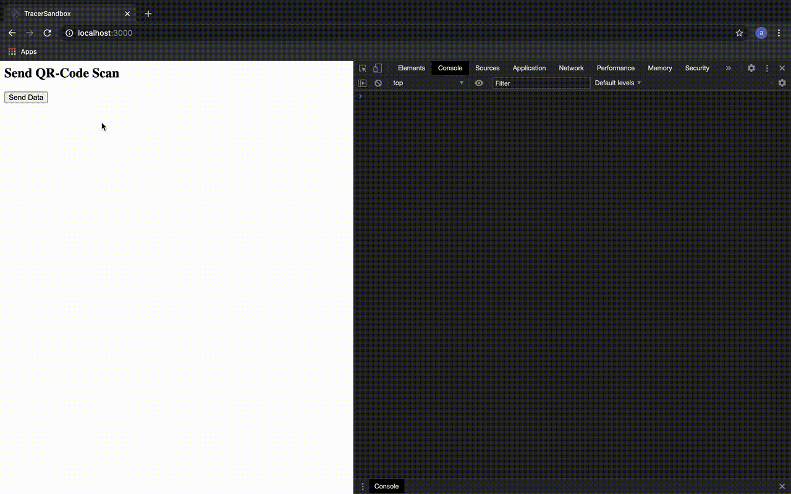

Backend w/ Deno
====== 

to run the server use: __deno run --allow-net --allow-read --allow-write --allow-env --unstable ./server/src/backendServer.ts__
→ server runs on __localhost:3000__

Note: You need to have a (local) mySQL DB running: __mysql -u root -p__

Dependencies 
------

1. Opine
2. Jsonfile
3. cuid
4. [Localbase](https://github.com/dannyconnell/localbase)
5. Jquery

1_Log_New_Scan
------

- [x] set locID & timestamp
- [x] store locID & timestamp in ~~./databases/LocalBuffer.json~~ [indexedDB](https://developer.mozilla.org/en-US/docs/Web/API/IndexedDB_API) database
- [x] send locID & timestamp via url (get)
- [x] generate cuid
- [x] store locID, cuid & timestamp in ./databases/GlobalDatabase.json
- [x] return cuid to client
- [x] store data in indexedDB database first and clear entry after response from server (offline functionality)

Report Case 
------
1. Button to report (no verification) 
2. Send list of IDs (From local DB) to backend
3. [WIP] In Backend, set status = positive for all IDs
4. Set a status variable in client side to true
    - Instead of status variable, maybe just key in object?
    - Create a timeOfStatus variable with the timestamp of the date of test -> continuously test if it is younger than 14 days
5. As long as variable is true, write status = positive in new scans
    - Check after each visit if variable is < (today - 14 days)
    - If no: Alert(you shouldn‘t go outside!)
6. Delete old entries from localbase in client

Risk status
1. After setting status = positive, set for all visits within timerange +- 2 in the same location the risk to 1

Check risk
1. Pass all IDs from localDB
2. Select user.risk where user.id = [ID1, ..., IDn]
3. 0 = low risk, else 1 (n) possible encounter.

